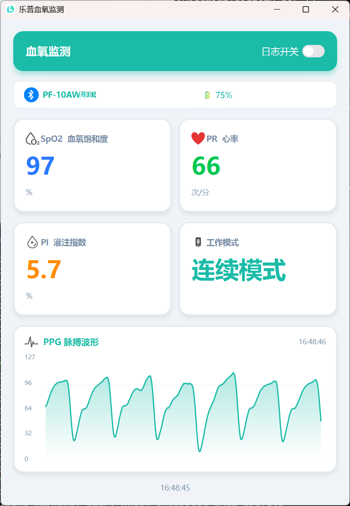

# LEPU PF-10AW Pulse Oximeter BLE App

## Quick Start

1. Clone the repository:

2. Install the dependencies:

```bash
pip install -r requirements.txt
```

3. Run the app:

```bash
python gui.py
```

Run the app on Python 3.8 or higher.

Run effect:



You can enable log and monitor the PPG wave data by clicking the "Log" button.

neurokit2 is used to analyze the PPG wave data.

```bash
pip install neurokit2
```